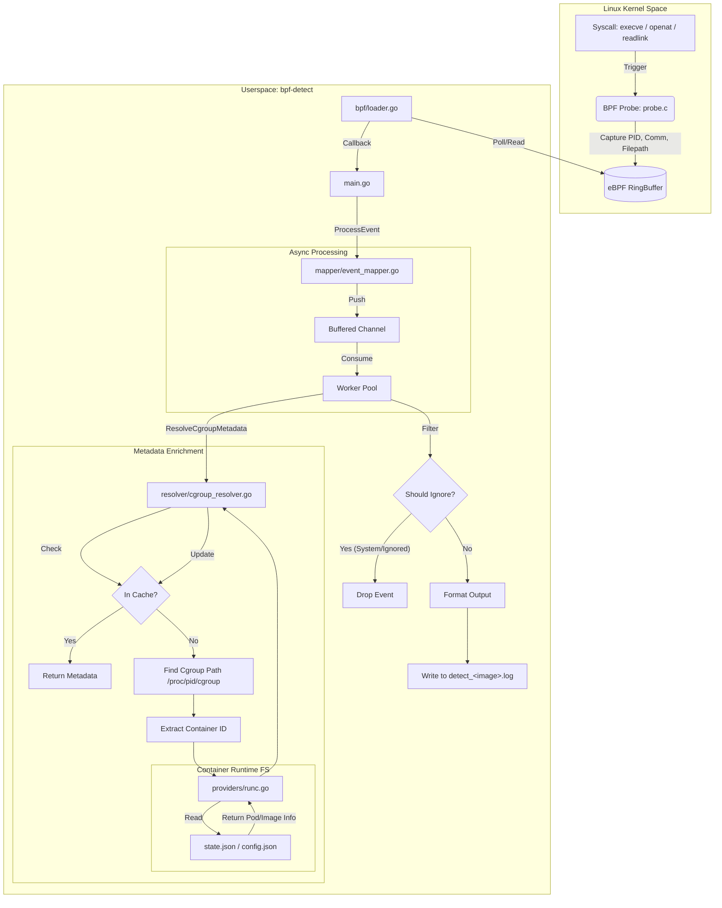

# ESDetect

The eBPF/SBOM Detect. It uses eBPF to detect the runtime events relevant to the SBOM format. Bridge the gap between static analysis and runtime reality by using eBPF to verify which SBOM dependencies are actually executed, enabling you to confidently identify unused packages and prioritize reachable vulnerabilities.

## Components

**ESDetect**: Captures runtime events (`execve`, `open`, `readlink`) using native eBPF (Go) or `bpftrace` (legacy) and resolves container/Kubernetes metadata.

## Prerequisites

-   **Linux Kernel**: Recent version supporting eBPF (CO-RE preferred).
-   **Go**: Version 1.23+ (To build the detection tool).
-   **Python 3**: For the correlation scripts.
-   **Root Privileges**: Required to run the tool and access cgroup information.
-   **bpftrace** (Optional): Only required if using legacy mode.

## Installation

### 1. Build the Detection Tool (ESDetect)

The detection tool processes the raw BPF output and adds container metadata. It is recommended to build it using the provided Docker script to ensure all dependencies (including `libbpf`) are correctly installed.

```bash
./src/build_in_docker.sh
```

### 2. Running with Docker

You can run `ESDetect` directly as a Docker container. This requires privileged access and specific volume mounts to inspect the host system.

**Build the Image**

```bash
docker build -t detect:1.0 .
```

**Run the Container**

Standard Docker (Rootful):
```bash
docker run -it --rm \
  --privileged \
  --pid=host \
  -v /sys/kernel/debug:/sys/kernel/debug:rw \
  -v /proc:/proc:ro \
  -v /run:/run:ro \
  -v /sys/fs/cgroup:/sys/fs/cgroup:ro \
  -v /var/lib/docker:/var/lib/docker:ro \
  detect:1.0
```

Rootless Docker:
If you are using Rootless Docker, you must mount your user's Docker data directory (usually `~/.local/share/docker`) to `/var/lib/docker` inside the container so the tool can resolve image names.

```bash
docker run -it --rm \
  --privileged \
  --pid=host \
  -v /sys/kernel/debug:/sys/kernel/debug:rw \
  -v /proc:/proc:ro \
  -v /run:/run:ro \
  -v /sys/fs/cgroup:/sys/fs/cgroup:ro \
  -v $HOME/.local/share/docker:/var/lib/docker:ro \
  detect:1.0
```

## Usage
### Example Scenarios

Here are 5 common ways to use `ESDetect`:

**1. Standard Detection with JSON Output**
Use this for integration with **ESVerdict** or other tools. JSON format is easier to parse programmatically.
```bash
sudo ./bpf-detect -output-format json
```

**2. Debugging Container Resolution**
If you are not seeing events for your container, enable debug logging to see how cgroups are being resolved.
```bash
sudo ./bpf-detect -debug
```

**3. Monitoring Host Processes**
By default, host events are ignored. Use this flag to capture file access events from processes running directly on the host.
```bash
sudo ./bpf-detect -print-host-events
```

**4. Custom Output Directory**
Store the generated log files in a specific directory (e.g., for a specific test run).
```bash
mkdir -p ./test-results
sudo ./bpf-detect -output-dir ./test-results
```

**5. Full Capture (Disable Filtering)**
By default, system events (like Kubernetes system pods) are filtered out. Disable this to see all activity.
```bash
sudo ./bpf-detect -filter-system-events=false
```

**6. Custom Filtering**
You can provide a JSON configuration file to define custom filtering rules. This is useful for ignoring specific noisy processes or paths.

```bash
sudo ./bpf-detect -filter-config tests/filters.json
```

For a complete guide on available fields, operators, and configuration examples, see the [Dynamic Filtering Documentation](docs/filtering.md).


## Architecture



### 1. Runtime Detection (ESDetect)

The detection phase captures file access and execution events.

#### Using the Wrapper Script

The easiest way to run the detection is using the provided script:

```bash
./run.sh
```

This script runs the `bpf-detect` tool in native eBPF mode.

#### Manual Execution

You can also run the tools manually for more control:

```bash
# Native eBPF mode (Recommended)
sudo ./bpf-detect [flags]

# Legacy mode (using bpftrace)
sudo bpftrace trace.bt | sudo ./bpf-detect -use-bpftrace [flags]
```

**Arguments for `bpf-detect`:**

| Flag | Type | Default | Description |
| :--- | :--- | :--- | :--- |
| `-output-dir` | string | `.` | Directory to store log files. |
| `-output-format` | string | `text` | Output format (`text`, `json`). |
| `-debug` | bool | `false` | Enable debug logging. |
| `-print-host-events` | bool | `false` | Print events from host processes (non-containerized). |
| `-filter-system-events` | bool | `true` | Filter out system events (k8s system pods, common system commands). |
| `-filter-config` | string | `""` | Path to a JSON file containing custom filter rules. |
| `-metadata-provider` | string | `all` | Metadata provider to use (`all`, `runc`). |
| `-use-bpftrace` | bool | `false` | Use legacy bpftrace input mode (stdin). |
| `-workers` | int | `4` | Number of concurrent worker routines for event processing. |
| `-buffer-size` | int | `10000` | Size of the event buffer channel. |

**Output:**
The tool will generate log files in the specified output directory. Timestamps are automatically added to all events.

*   `detect_<image_tag>.log`: Events associated with a specific container image (e.g., `detect_nginx_latest.log`).
*   `detect_host.log`: Events associated with host processes (if enabled).
*   `detect_k8s.log`: Events associated with Kubernetes pods (if image tag cannot be resolved).
*   `detect_unknown.log`: Events where the source could not be identified.

## Running Examples

The `examples/` directory contains sample applications in various languages (Go, Java, Python, Node.js, etc.) to help you test `ESDetect`.

### 1. Build Example Applications
Build the Docker images for all example apps:
```bash
cd examples
./build_all.sh
cd ..
```

### 2. Start ESDetect
In a separate terminal, start the detection tool to listen for events:
```bash
sudo ./bpf-detect
```

### 3. Run Example Containers
Launch the containers to generate runtime activity:
```bash
cd examples
./run_containers.sh
```

### 4. Generate Traffic (Optional)
For web applications (Node.js, Python), generate HTTP requests to trigger more code paths:
```bash
./run_requests.sh
```

### 5. Stop Containers
Clean up the running containers:
```bash
./stop_containers.sh
```

### 6. Verify Results
Check the `logs/` directory (or your configured output directory) for the generated log files:
```bash
ls -l logs/
cat logs/detect_python-app.log
```

## Next Steps

After collecting the runtime trace using ESDetect, the next step is to use **ESVerdict** to correlate this trace with your application's SBOM to identify used and unused packages.

## Troubleshooting

*   **Permission Denied**: Ensure you are running both `bpftrace` and `bpf-detect` with `sudo`.
*   **No Logs**: Check if `bpftrace` is generating output. You can test `bpftrace trace.bt` separately.
*   **Missing Metadata**: Ensure the tool has access to `/var/run/docker.sock` or `/run/containerd/containerd.sock` (or equivalent paths defined in `config.go`).

## Project Structure

-   `trace.bt`: The `bpftrace` script.
-   `src/`: Go implementation of the metadata resolver (Recommended).
-   `src_python/`: Python implementation of the metadata resolver (Legacy).
-   `examples/`: Example applications in various languages for testing.

## License

This project is licensed under the **Apache License 2.0**.

See the `LICENSE` file for full details.
